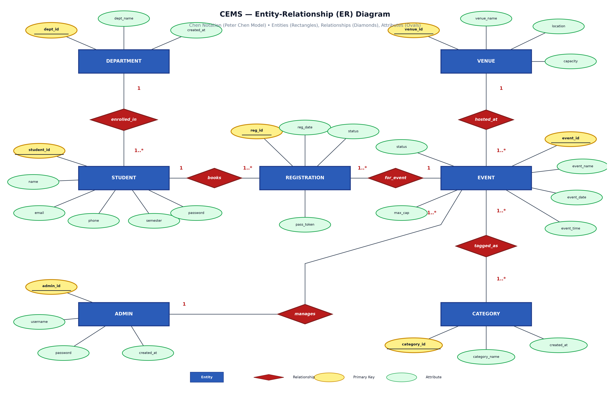
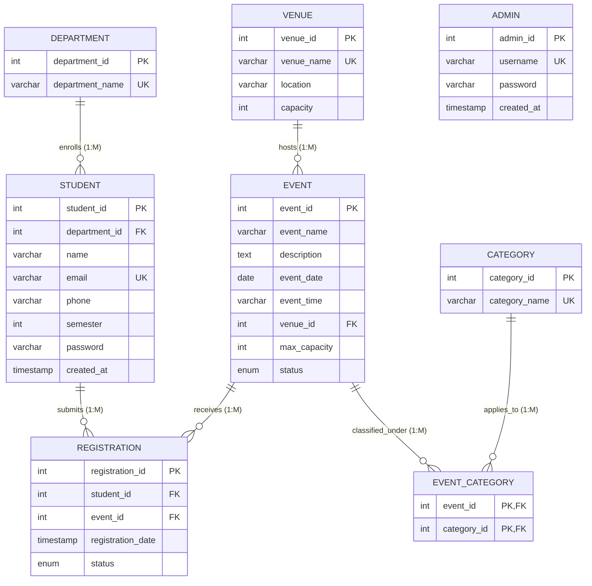

# Entity-Relationship (ER) Diagram — CEMS

## 1. Classical Peter Chen E-R Diagram

The diagram below follows the classic **Peter Chen Database Modeling Notation** (as taught in standard academic DBMS textbooks):
- **Blue Rectangles**: Strong / Weak Entities (`DEPARTMENT`, `STUDENT`, `REGISTRATION`, `EVENT`, `VENUE`, `CATEGORY`, `ADMIN`)
- **Red Diamonds**: Relationship sets (`enrolled_in`, `books`, `for_event`, `hosted_at`, `tagged_as`, `manages`)
- **Green Ovals**: Entity Attributes
- **Underlined Attribute Text**: **Primary Key (PK)** identifiers (e.g., <u>dept_id</u>, <u>student_id</u>, <u>reg_id</u>, <u>event_id</u>, <u>venue_id</u>, <u>category_id</u>, <u>admin_id</u>)
- **Cardinality Ratios**: Displayed in red text (`1`, `1..*`, or `M:N`) indicating mapping constraints.



> **Vector SVG Available**: [`docs/er_diagram_chen.svg`](er_diagram_chen.svg) (can be scaled without loss of resolution).

---

## 2. How to View / Generate ER Diagram in MySQL Workbench

If your teacher or examiner asks you to show the live database diagram inside **MySQL Workbench**:

1. Open **MySQL Workbench**.
2. Connect to your local MySQL instance (Hostname: `127.0.0.1`, Port: `3306`, User: `root`).
3. In the top navigation menu, click:
   $$\text{\textbf{Database}} \longrightarrow \text{\textbf{Reverse Engineer...}} \quad (\text{Shortcut: } \mathbf{Ctrl + R})$$
4. Select your stored MySQL connection and click **Next**.
5. When prompted to select schemas, check **`cems_db`** and click **Next**.
6. Select **"Import MySQL Table Objects"** and click **Execute**.
7. Click **Finish**.
8. MySQL Workbench will instantly render the visual **EER (Enhanced Entity-Relationship) Diagram Canvas** showing:
   - All 7 tables: `department`, `student`, `registration`, `event`, `venue`, `category`, `event_category`, `admin`.
   - Visual Crow's Foot connectors for every Foreign Key (`ON DELETE CASCADE`, `ON DELETE RESTRICT`).
   - Indexes, primary keys (gold keys), and nullability flags.
9. You can export this live diagram at any time:
   $$\text{\textbf{File}} \longrightarrow \text{\textbf{Export}} \longrightarrow \text{\textbf{Export as PNG...} / \textbf{Export as PDF...}}$$

---

## 3. Relational ER Model Overview

The College Event & Registration Management System (**CEMS**) is engineered around a normalized relational model satisfying **Third Normal Form (3NF)**.

### Entities & Cardinalities

```
+---------------------+              +---------------------+
|     DEPARTMENT      |              |        VENUE        |
+---------------------+              +---------------------+
| PK  department_id   |              | PK  venue_id        |
|     department_name |              |     venue_name      |
+----------+----------+              |     location        |
           | 1                       |     capacity        |
           |                         +----------+----------+
           | M                                  | 1
+----------v----------+                         |
|       STUDENT       |                         |
+---------------------+                         |
| PK  student_id      |                         |
| FK  department_id   |                         |
|     name            |                         |
|     email           |                         |
|     phone           |                         |
|     semester        |                         |
|     password        |                         |
|     created_at      |                         |
+----------+----------+                         |
           | 1                                  |
           |                                    |
           | M                                  | M
+----------v----------+              +----------v----------+
|    REGISTRATION     |              |        EVENT        |
+---------------------+              +---------------------+
| PK  registration_id |              | PK  event_id        |
| FK  student_id      |              |     event_name      |
| FK  event_id        |<-------------|     description     |
|     registration_date              |     event_date      |
|     status          |              |     event_time      |
+---------------------+              | FK  venue_id        |
                                     |     max_capacity    |
                                     |     status          |
                                     +----------+----------+
                                                | M
                                                |
                                                | M (Resolved by Junction)
                                     +----------v----------+
                                     |   EVENT_CATEGORY    |
                                     +---------------------+
                                     | PK,FK event_id      |
                                     | PK,FK category_id   |
                                     +----------+----------+
                                                | M
                                                |
                                                | 1
                                     +----------v----------+
                                     |      CATEGORY       |
                                     +---------------------+
                                     | PK  category_id     |
                                     |     category_name   |
                                     +---------------------+

                                     +---------------------+
                                     |        ADMIN        |
                                     +---------------------+
                                     | PK  admin_id        |
                                     |     username        |
                                     |     password        |
                                     |     created_at      |
                                     +---------------------+
```

---

## 2. Mermaid Relational Diagram



---

## 3. Detailed Relationship Semantics

| Relationship | Type | Parent Entity | Child Entity | Foreign Key | Enforcement Rule | Rationale |
|---|---|---|---|---|---|---|
| **DEPARTMENT &rarr; STUDENT** | One-to-Many ($1:M$) | `DEPARTMENT` | `STUDENT` | `department_id` | `ON UPDATE CASCADE ON DELETE RESTRICT` | A department contains many enrolled students. A student must belong to exactly one academic department. Deleting a department with enrolled students is restricted to prevent orphaned student records. |
| **VENUE &rarr; EVENT** | One-to-Many ($1:M$) | `VENUE` | `EVENT` | `venue_id` | `ON UPDATE CASCADE ON DELETE RESTRICT` | A campus facility can host multiple sequential events. An event is scheduled at exactly one physical venue. Venues cannot be removed if events are assigned to them. |
| **STUDENT &rarr; REGISTRATION** | One-to-Many ($1:M$) | `STUDENT` | `REGISTRATION` | `student_id` | `ON UPDATE CASCADE ON DELETE CASCADE` | A student may register for multiple campus programs. Each registration belongs to one verified student. |
| **EVENT &rarr; REGISTRATION** | One-to-Many ($1:M$) | `EVENT` | `REGISTRATION` | `event_id` | `ON UPDATE CASCADE ON DELETE CASCADE` | An event receives multiple student registrations up to its capacity limit. |
| **EVENT &harr; CATEGORY** | Many-to-Many ($M:M$) | `EVENT` / `CATEGORY` | `EVENT_CATEGORY` | `(event_id, category_id)` | Composite PK; `ON UPDATE CASCADE ON DELETE CASCADE` | An event can belong to multiple categories (e.g., both "Technical" and "Competitions"). A category spans multiple events. Resolved cleanly via associative table `EVENT_CATEGORY`. |
| **STUDENT &harr; EVENT** | Many-to-Many ($M:M$) | `STUDENT` / `EVENT` | `REGISTRATION` | `(student_id, event_id)` | `UNIQUE(student_id, event_id)` | A student registers for many events; an event holds many students. Resolved by `REGISTRATION` with an explicit composite unique constraint to forbid duplicate registrations. |
| **ADMIN** | Independent System Entity | — | — | — | Standalone | Governs system management, entity CRUD, and institutional reporting. |
